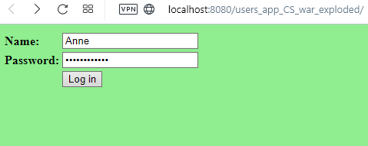
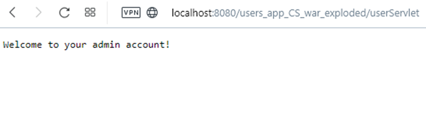

**Web Authentication & Authorization**

**Course: Cryptography and Security**

**Laboratory work Nr. 5**

**Author: Vladimir Russu**

<strong style="color: black;">&nbsp;</strong>

**Objectives**

· To create a web service for authenticating and authorizing user access.

· To use cryptographic and hashing algorithms in order to store passwords

**Implementation**

I have created a web service application which provides authentication and authorization for the users. In order to store the user data, I have made a class with an array of users that have the following attributes: username, password (encrypted and hashed) and role (default user/ admin). In order to create particular users, first there is a class for constructing user objects and getting all the required user parameters:

<pre>public class user {
private String name, password, role;

public user(String name, String password, String role) {
this.name = name;
this.password = password;
this.role = role;
}

public String getName () {
return name;
}

public void setName (String name) {
this.name = name;
}

public String getPassword () {
return password;
}

public void setPassword (String password) {
this.password = password;
}

public String getRole () {
return role;
}

public void setRole (String role) {
this.role = role;
}
}
</pre>
Then there is the class mentioned earlier, which creates a collection of user objects:
<pre>
public class usersCollection {

public static int key = 5;

public static String permutate = "perm";

public static user[] usersSaved() {

user[] users = new user[5];

String passUser1 = "passU578945";

String pass1Ciphertext = caesarCipherPermutation.encrypt(passUser1, key, permutate);

String pass1Hashtext = sha256.sha(pass1Ciphertext);

users[0] = new user("John", pass1Hashtext, "user");

String passUser2 = "123wort578";

String pass2Ciphertext = caesarCipherPermutation.encrypt(passUser2, key, permutate);

String pass2Hashtext = sha256.sha(pass2Ciphertext);

users[1] = new user("Julia", pass2Hashtext, "user");

String passUser3 = "kennen2357";

String pass3Ciphertext = caesarCipherPermutation.encrypt(passUser3, key, permutate);

String pass3Hashtext = sha256.sha(pass3Ciphertext);

users[2] = new user("William", pass3Hashtext, "admin");

String passUser4 = "speichern579";

String pass4Ciphertext = caesarCipherPermutation.encrypt(passUser4, key, permutate);

String pass4Hashtext = sha256.sha(pass4Ciphertext);

users[3] = new user("Anne", pass4Hashtext, "admin");

String passUser5 = "12schreiben98";

String pass5Ciphertext = caesarCipherPermutation.encrypt(passUser5, key, permutate);

String pass5Hashtext = sha256.sha(pass5Ciphertext);

users[4] = new user("Richard", pass5Hashtext, "user");

return users;

}

}
</pre>
In this class user object gets a password attributed to it after that password has been encrypted and hashed. First, the password is being encrypted using Caesar cipher with permutation algorithm and a predefined key of value 5 and permutation string of value “perm”. Then the obtained ciphertext is being hashed using the SHA-256 algorithm. And the final hashtext value is being attributed to the user’s password and stored as his/her password.

The following is the class which has a method for performing encryption of a plaintext using the Caesar Cipher with Permutation algorithm (that method is further called to encrypt user’s password as explained above):
<pre>
public class caesarCipherPermutation {

public static String encrypt(String plaintext, int key, String permutation) {

String alphabet = "abcdefghijklmnopqrstuvwxyz0123456789";

char[] inputArrayChar = plaintext.toLowerCase().toCharArray();

String permToL = permutation.toLowerCase();

String newAlph = permToL + removeCharsOfPermutation(alphabet, permToL);

String encrMessage = "";

for (int k=0; k < inputArrayChar.length; k++) {

int encrCharPos = (newAlph.indexOf(inputArrayChar[k]) + key) % 26;

char encrChar = newAlph.charAt(encrCharPos);

encrMessage+=encrChar;

}

return encrMessage;

}

public static String removeCharsOfPermutation(String str1, String str2) {

for (int index = 0; index < str2.length(); index++) {

char k = str2.charAt(index);

while (str1.contains(k + "")) {

int i = str1.indexOf(k);

str1 = str1.replace((k + ""), "");

}

}

return str1;

}

}
</pre>
Then there is a class with a method to obtain hashtext of a plaintext using SHA-256 algorithm (that method is further called to hash user’s password ciphertext as explained above):
<pre>
public class sha256 {

public static String sha(String password)

{

try {

MessageDigest mD = MessageDigest.getInstance("SHA-256");

byte[] messDig = mD.digest(password.getBytes());

BigInteger signumRepr = new BigInteger(1, messDig);

String hashText = signumRepr.toString(16);

return hashText;

}

catch (NoSuchAlgorithmException e) {

System.out.println("Incorrect algorithm: " + e);

return null;

}

}

}
</pre>
The web application itself is represented, first, by a page which provides input fields for the user to enter his/her credentials (name, password). After the user has entered his/her credentials, there is a button “Login” which submits the values of the name and the password input fields.

Next I have created a servlet class “welcome” which performs authentication and authorization checks according to the users’ given credentials. This class implements the “Filter” interface from the “javax.servlet” library and overrides the “doFilter” method in order to authenticate and authorize users. In this method the name and the password from user input are being obtained via an HTTP request as correspondent parameters. Then the password obtained by the request in encrypted using the Caesar Cipher with Permutation algorithm and the same key and same permutation string as that used for encrypting the passwords which were initially attributed to users. After that the password ciphertext is being hashed. And after that there is a for loop to traverse the array of all users and check if the name and password-ciphertext hash from the input are identical with the name and password attributed to a user initially. If it is true, then the authentication is performed successfully. And the next step is to check what the user is authorized to do (default user/ admin). In order to do that, it is checked further whether the role of that specific user is “user” or “admin”. If the user is role “user”, then he/she gets the welcome message for the user. If the user role is “admin”, then he/she gets the welcome message for admin. But if the input name and password-ciphertext hash are not identical with any of the users’ names and passwords, then the message about an authentication error is printed out. The following is the whole code of the “welcome” class:
<pre>
public class welcome implements Filter {

@Override

public void init(FilterConfig arg0) throws ServletException {

}

@Override

public void doFilter(ServletRequest req, ServletResponse resp, FilterChain chain) throws IOException, ServletException {

PrintWriter out = resp.getWriter();

String name = req.getParameter("name");

String password = req.getParameter("password");

int key = usersCollection.key;

String permutate = usersCollection.permutate;

String passCiphertext = caesarCipherPermutation.encrypt(password, key, permutate);

String passHashtext = sha256.sha(passCiphertext);

int flag = 0;

for (int i = 0; i < usersCollection.usersSaved().length; i++) {

if (name.equals(usersCollection.usersSaved()[i].getName()) && passHashtext.equals(usersCollection.usersSaved()[i].getPassword())) {

flag++;

if (usersCollection.usersSaved()[i].getRole() == "user") {

out.print("Welcome to your user account!");

RequestDispatcher rd = req.getRequestDispatcher("index.jsp");

}

if (usersCollection.usersSaved()[i].getRole() == "admin") {

out.print("Welcome to your admin account!");

RequestDispatcher rd = req.getRequestDispatcher("index.jsp");

}

}

}

if (flag == 0) {

out.print("Username or password error!");

RequestDispatcher rd = req.getRequestDispatcher("index.jsp");

}

}

@Override

public void destroy() {

}

}
</pre>
In order to output the results of the authentication and authorization there is “userServlet” class which extends the HttpServlet class from the “javax.servlet.http” library:
<pre>
public class userServlet extends HttpServlet {

@Override

public void doGet(HttpServletRequest request, HttpServletResponse response) throws ServletException, IOException {

response.setContentType("text/html");

}
</pre>

**Results**

The results of running the application are the following, as an example:

After clicking the “Log in” button the admin gets authenticated and authorized as admin:
